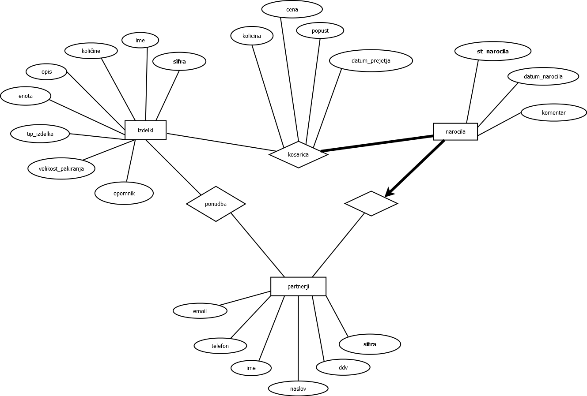

# the_real_skladisce

Avtorja:

* Paolo Seravalli
* Karel Križnar

## Opis
Baza bo namenjena evidenci naročil materiala v nekem podjetju. V njej bomo hranili podatke o naročilih (material, podjetje, cena, količina, popusti, ...), tako kot tudi samo stanje v skladišču s porabo materialov (koliko še v skladišču).

## ER Diagram

